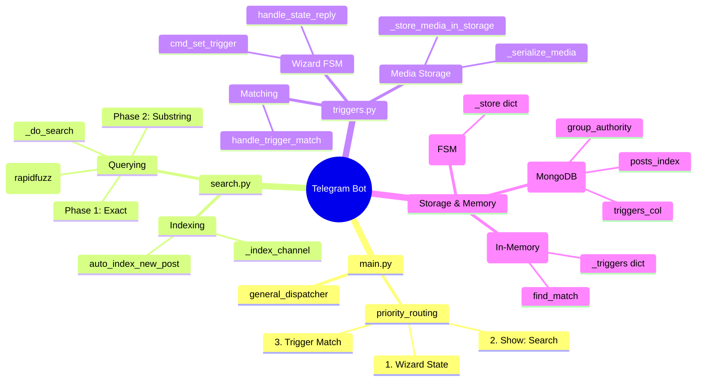
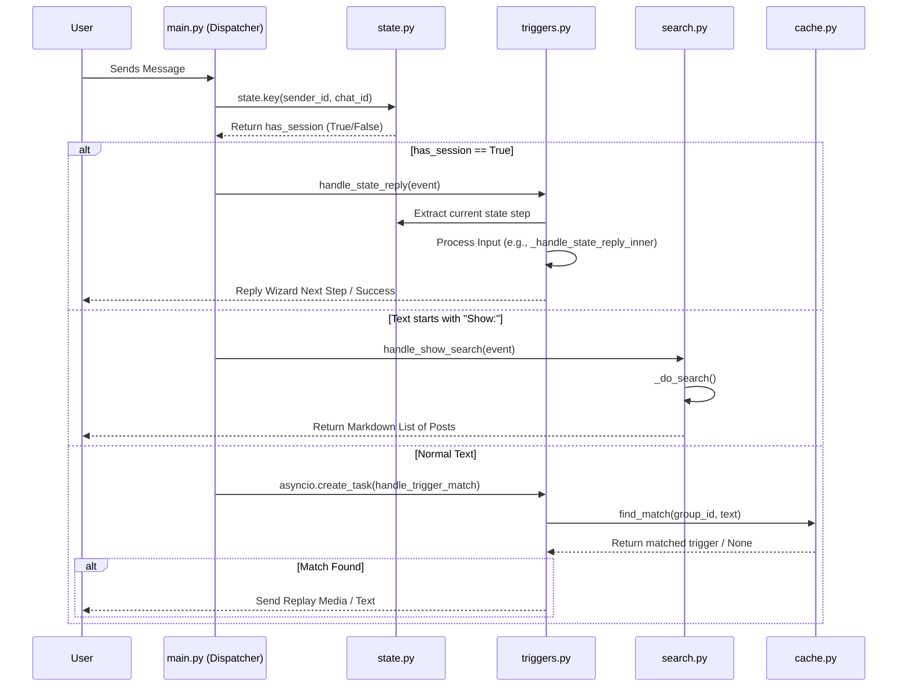
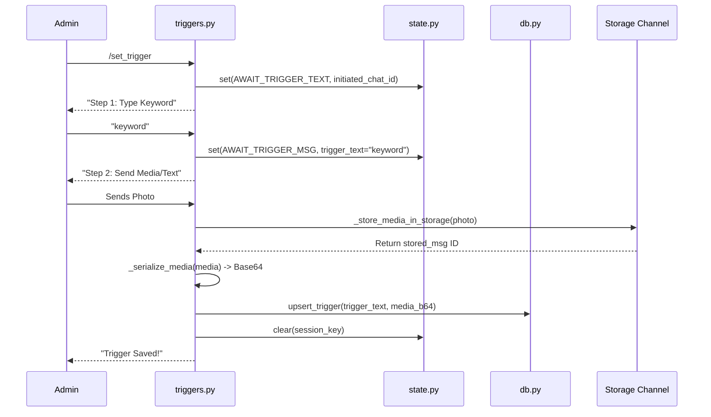
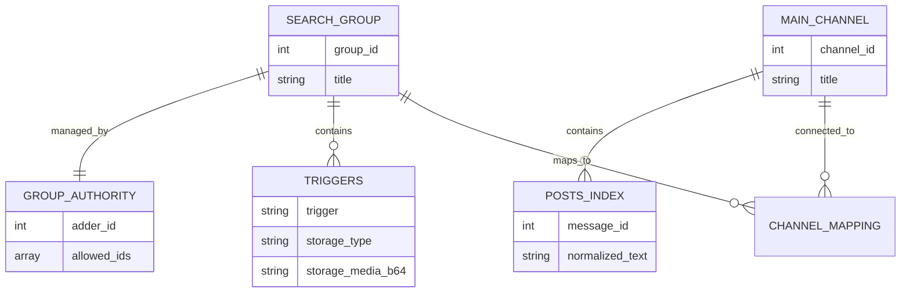

# Project Maps and Visualizations

This file contains Mermaid visual diagrams generated precisely from the codebase logic to help any new developer immediately grasp the structure and data flow.

## 1. System Mind Map

## 2. Core Data Flow: Message Dispatching Pipeline

## 3. Data Flow: Setting up a Trigger (Wizard)

## 4. Database Connection Topology

