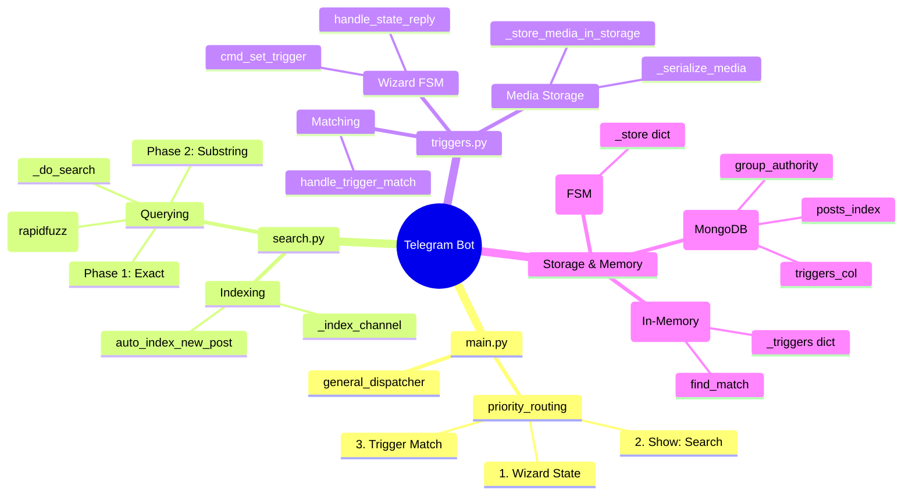
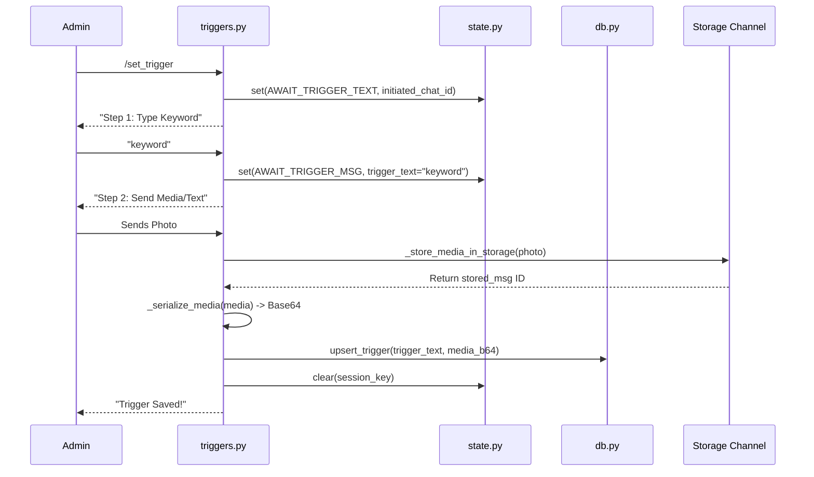

# Telegram Bot Comprehensive Project Details

This document provides a highly detailed, code-based breakdown of the bot's functionality, focusing on explicit data flows, mind maps, edge cases, and problem areas. It is written directly based on the actual Python source code (`main.py`, `triggers.py`, `search.py`, `db.py`, `cache.py`, `state.py`) so any new developer can immediately grasp the structure and begin working.

---

## 1. System Architecture Mind Map

---

## 2. Core Modules

The bot is built using Python, `Telethon` for the Telegram MTProto API, and `Motor` (Async MongoDB) for storage. It is structured into distinct, isolated modules:

| Module | Core Responsibility | Key Functions |
| :--- | :--- | :--- |
| **`main.py`** | Entry point and core dispatcher. Priorities: 1) Active wizard state, 2) Search command, 3) Trigger match. | `general_dispatcher`, `startup`, `cmd_help`, `cmd_refresh_admins` |
| **`triggers.py`** | Feature 1: Keyword-to-media response system. Handles the 2-step setup wizard and trigger matching. | `cmd_set_trigger`, `handle_state_reply`, `handle_trigger_match`, `_store_media_in_storage` |
| **`search.py`** | Feature 2: Cross-channel indexed search. Handles mapping `search_groups` to `main_channels` and querying `posts_index`. | `cmd_connect_channel`, `_index_channel`, `_do_search`, `handle_show_search` |
| **`db.py`** | MongoDB operations. Highly normalized schema managing groups, authorities, triggers, and post indexes. | `upsert_trigger`, `upsert_group_authority`, `exact_search`, `substring_search` |
| **`cache.py`** | In-memory trigger cache mapping `group_id` to a list of triggers. Optimizes DB queries. | `warm`, `invalidate_group`, `find_match` |
| **`state.py`** | In-memory Finite State Machine (FSM) for managing multi-step wizard sessions (e.g., `/set_trigger`). | `set`, `get`, `clear`, `key` |

---

## 3. Explicit Data Flow Points & Sequence Diagrams

This section maps EXACTLY how data flows through the functions for critical operations.

### 3.1 Data Flow: Setup Wizard Initialization (`/set_trigger`)

**Step-by-step description:**
1. **Trigger:** User sends `/set_trigger` in a group.
2. **`triggers.cmd_set_trigger(event)`** extracts `sender_id`, checks DB registration, and validates admin rights.
3. **Data Move:** Passes state data to `state.set(session_key, state.AWAIT_TRIGGER_TEXT, ...)`.
4. **`state.set(...)`** stores a `ConvState` object in the global `_store` dictionary.

### 3.2 Data Flow: State Reply Handling (Wizard Step 2)
1. **Trigger:** User sends the keyword (e.g., "batman").
2. **`main.general_dispatcher(event)`** generates `session_key = state.key(sender_id, event.chat_id)`. Checks `state.has(session_key)`.
3. **Data Move:** If state exists, calls `await triggers.handle_state_reply(event)`.
4. **`triggers.handle_state_reply(event)`** validates `initiated_chat_id` and `created_by_id` against the event to ensure strict isolation. Adds `(sender_id, msg_id)` to `_in_flight` set to prevent double processing.
5. **Data Move:** Calls `_handle_state_reply_inner(event, session_key, sender_id, current)`.
6. **`triggers._handle_state_reply_inner(...)`** normalizes the keyword via `helpers.normalize_trigger`. Updates the FSM by calling `state.set(...)` with step `AWAIT_TRIGGER_MSG` and includes `trigger_text`.

### 3.3 Data Flow: Search Processing (`Show: <query>`)
1. **Trigger:** User sends `Show: batman` in a registered search group.
2. **`main.general_dispatcher(event)`** routes it to `search.handle_show_search(event)`.
3. **`search.handle_show_search(event)`** extracts `show_name`. Retrieves connected channel IDs via `db.get_main_channel_ids_for_group(search_group_id)`.
4. **Data Move:** Calls `_do_search(show_name, search_group_id)`.
5. **`search._do_search(query, search_group_id)`** performs a 3-phase search:
   - *Phase 1:* `db.exact_search`
   - *Phase 2:* `db.substring_search`
   - *Phase 3:* `db.get_posts_for_fuzzy` followed by `rapidfuzz.process.extract`.
6. **Return:** A list of matching post dictionaries back to `handle_show_search` which formats the results into markdown and replies `event.reply(...)`.

### 3.4 Data Flow: Trigger Matching
1. **Trigger:** Normal text message is sent in a group.
2. **`main.general_dispatcher(event)`** creates task for `triggers.handle_trigger_match(event)`.
3. **`triggers.handle_trigger_match(event)`** extracts text via `_message_content_text`.
4. **Data Move:** Calls `cache.find_match(group_id, text)`.
5. **`cache.find_match(group_id, text)`** looks up `_triggers[group_id]`. Iterates to find substring matches. Returns the `max()` length match.
6. **Back to `handle_trigger_match`**: Checks `storage_type`. If `media`, deserializes `storage_media_b64` via `_deserialize_media()`.
7. **Action:** Sends the media back using `client.send_file(event.chat_id, media, caption=stored_text)`.

---

## 4. Logic Simulations & Test Cases

This section simulates exact logic flows to understand how the system behaves under standard, abnormal, and edge-case conditions.

### Simulation 1: Setup Wizard Isolation 
**Context:** User (ID: 111) is an Admin in Group A and Group B.
1. User sends `/set_trigger` in **Group A**.
   - `triggers.cmd_set_trigger` executes. `state.set((111, GroupA), AWAIT_TRIGGER_TEXT)` is recorded with `initiated_chat_id = GroupA`.
2. User sends "batman" in **Group B** (accidentally).
   - `main.general_dispatcher` receives event for Group B. Fallback calls `state.find_for_user(111)` -> Returns the state from Group A.
   - `handle_state_reply` runs and sees `event.chat_id (Group B) != initiated_chat_id (Group A)`.
   - **Result:** Logs isolation warning. The word "batman" is ignored by the wizard and allowed to pass as a normal message.
3. Another User (ID: 222) sends a photo in **Group A**.
   - `handle_state_reply` runs. `event.sender_id (222) != created_by_id (111)`.
   - **Result:** Photo is ignored. Wizard remains open exclusively for User 111.

### Simulation 2: Trigger Matching Substring Rule
**Context:** Group has triggers saved: `[{"trigger": "apple"}, {"trigger": "apple pie"}]`.
1. User sends "I love apple pie".
2. `cache.find_match` converts to lowercase: "i love apple pie".
3. Iteration finds "apple" (Length 5) and "apple pie" (Length 9).
4. `max()` calculates the longest match.
5. **Result:** Bot responds with media attached to "apple pie", preventing short triggers from overriding specific long-tail triggers.

### Simulation 3: Search Phase Filtering
**Context:** User searches `Show: The Boys` in Group X.
1. DB Phase 1 (`exact_search`): Does normalized text strictly equal `the boys`? (0 results).
2. DB Phase 2 (`substring_search`): Regex contain `the boys`? (Finds: "download the boys season 1").
3. DB Phase 3 (`fuzz_process`): Matches "da boyz" with a score of 85.
4. **Result:** Bot replies with exact substring matches first, supplemented by fuzzy typo matches.

### Edge Cases Verified
| Scenario | Code Action | Result |
| :--- | :--- | :--- |
| **User sends a Sticker in Step 1 of Wizard** | `_handle_state_reply_inner` checks media type. | Rejects sticker, tells user "Step 1 needs a text keyword". Wizard stays open. |
| **Bot is removed from Storage Channel** | `resolve_storage_peer` fails on startup. | `_storage_peer` remains `None`. Setup wizard will fail at step 2. |
| **User replies to a message with `/set_trigger`** | `cmd_set_trigger` detects `has_reply`. | Automatically uses the replied text as the keyword, jumps straight to `AWAIT_TRIGGER_MSG`. |

---

## 5. Problem Log, Bugs & Technical Debt

### 5.1 Critical Bugs & Security Risks
- **Insecure Object Serialization (`pickle`) in `triggers.py`:**
  - **Problem:** The code uses `pickle.dumps()` and `base64.b64encode()` to serialize arbitrary Telegram `Media` objects directly into MongoDB.
  - **Risk:** Unpickling data from a database is a massive security risk (RCE vulnerability). Furthermore, Telegram `Media` objects frequently change internal structures with library updates (Telethon). Updating Telethon will permanently break old triggers.
  - **Solution:** Extract raw IDs (`document_id`, `access_hash`, `file_reference`) and store them in JSON format.

- **State Management Data Loss in `state.py`:**
  - **Problem:** `_store: dict[Any, ConvState] = {}` is a global in-memory dictionary.
  - **Risk:** Bot restarts wipe out all ongoing setups, leaving users hanging midway.

- **Trigger Cache Scaling Issue in `cache.py`:**
  - **Problem:** The caching mechanism stores ALL triggers for ALL groups in memory. The `warm()` function fetches the entire `triggers` collection at startup.
  - **Risk:** Memory spikes at scale. Because it's an in-memory dictionary, the bot CANNOT be horizontally scaled. Cache invalidation will only apply to a single worker.

- **FloodWait Handling Blocking in `search.py`:**
  - **Problem:** `_index_channel` uses `await asyncio.sleep(e.seconds)` upon hitting a `FloodWaitError`.
  - **Risk:** Pauses the specific index loop for potentially hours, creating memory pressure and losing state if the bot restarts.

### 5.2 Unnecessary Complexity
- **Double Storage Attempt for Media (`_store_media_in_storage`):**
  - Attempts to send media three times in a try-except cascade (caption, no caption, forward). Creates excessive API calls and delays on failure.
- **Redundant Priority Fallback (`main.py`):**
  - Checks `state.has(session_key)` and if false, immediately searches the ENTIRE state dictionary via `state.find_for_user(sender_id)`. O(N) iteration over states per message received is extremely inefficient.

### 5.3 Missing Graceful Shutdown
- Signal handlers in `main.py` are registered but only print a log statement. They do not close the `TelegramClient` or disconnect `AsyncIOMotorClient`, risking uncommitted writes or hanging connections.
